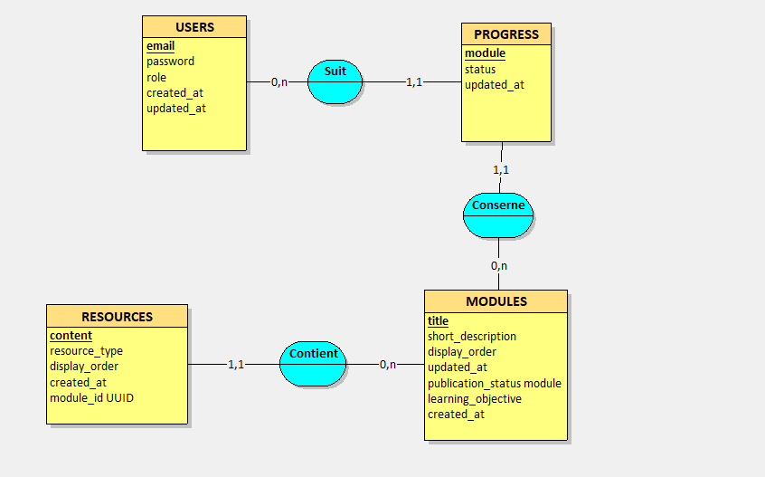
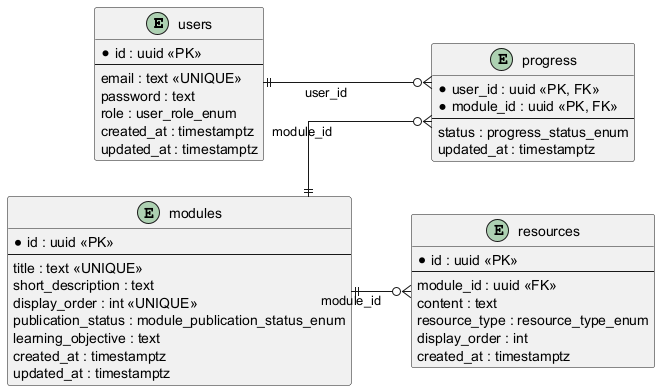
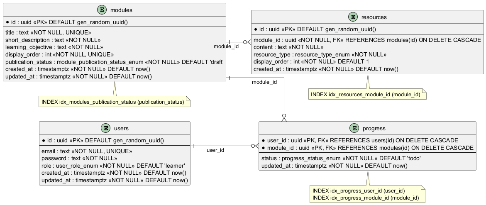

# Parcours DevOps Guide Présentation du projet

 Etat de la conception (Phase 1) et plan pour la réalisation (Phase 2) et l'extension du parcours pédagogique.

**Documenté le :** 18 juillet 2026

> Un site-lab pédagogique conçu en **dogfooding** : construire, sécuriser, automatiser et déployer une vraie application web **Parcours DevOps Guide** qui elle-même enseigne le DevOps à d'autres apprenant·es débutant·es, à travers un parcours structuré en modules avec suivi de progression.

---

## 1. Contexte et vision

Le projet consiste à construire une application web simple mais complète, puis à lui appliquer un vrai cycle de vie DevOps de bout en bout : développement en architecture séparée frontend / backend, conteneurisation, intégration continue, configuration et déploiement automatisés du serveur, documentation de la sécurité et de l'infrastructure.

> **Idée centrale le dogfooding :** utiliser moi-même les outils et pratiques DevOps pour construire, sécuriser et exploiter le site qui sert de support d'apprentissage à ces mêmes pratiques.

### Problème adressé

Apprendre le DevOps uniquement en théorie reste abstrait : l'automatisation reste superficielle, les problèmes de déploiement ne sont pas rencontrés en conditions réelles, et la sécurité, les tests et la reprise sur incident restent mal pratiqués sans projet concret.

### Cible

- Moi-même, en tant qu'apprenante
- Les apprenant·es débutant·es en DevOps

### Hors périmètre (pour rester réaliste)

Kubernetes, architecture microservices, multi-cloud avancé, observabilité de niveau production, plateforme SaaS multi-clients, plateforme e-learning complexe (quiz, cohortes, gamification avancée).

---

## 2. Le produit V1 : Parcours DevOps Guide

Le MicroSaaS aide des apprenant·es débutant·es en DevOps à suivre un parcours structuré en modules, à accéder aux ressources associées à chaque étape, et à enregistrer leur progression sans se disperser dans des contenus épars.

### Acteur·rices

| Rôle | Ce qu'il/elle peut faire |
| --- | --- |
| **Visiteur·se** | Consulte la présentation du produit et les contenus publics |
| **Apprenant·e authentifié·e** | Consulte les modules, accède aux ressources et suit sa progression |
| **Administrateur·rice** | Crée, modifie, publie et masque les modules et leurs ressources |

### Fonctionnalités V1

- Page publique de présentation du produit
- Authentification simple (création de compte, connexion)
- Liste des modules publiés, dans leur ordre pédagogique
- Page détaillée par module : objectif pédagogique, ressources associées (article, vidéo, lien, check-list)
- Suivi de progression par apprenant·e (à faire / en cours / terminé), remise à faire possible
- Interface d'administration minimale (créer/éditer un module, gérer ses ressources, publier/masquer)

### Hors périmètre V1

Quiz complexes, correction automatique, gamification avancée, gestion de cohortes, marketplace de contenus, sandbox technique ou laboratoire automatisé.

---

## 3. Modules pédagogiques

### 3.1 Modules V1 déjà spécifiés et maquettés (Figma)

Huit modules couvrent une première boucle complète, du terminal à la sécurité :

| # | Module | Publication | Progression (exemple) |
| --- | --- | --- | --- |
| 01 | Les bases de Linux et du terminal | Publié | Terminé |
| 02 | Git et le versioning | Publié | Terminé |
| 03 | Introduction à Docker | Publié | En cours |
| 04 | Intégration continue (CI) | Publié | À faire |
| 05 | Déploiement continu (CD) | Publié | À faire |
| 06 | Infrastructure as Code | Brouillon | À faire |
| 07 | Monitoring et observabilité | Publié | À faire |
| 08 | Sécurité DevOps | Masqué | À faire |

### 3.2 Modules proposés pour la suite (Phase 2 / Phase 3)

En plus des pistes déjà envisagées **Ansible**, **Kafka / Debezium**, **Kubernetes** voici une proposition de parcours étendu, dans un ordre pédagogique logique :

| # | Module proposé | Pourquoi à cet endroit du parcours |
| --- | --- | --- |
| 09 | **Ansible** gestion de configuration | Complète le module "Infrastructure as Code" : automatiser la préparation d'un serveur, cohérent avec la stack DevOps déjà retenue pour ce projet |
| 10 | Terraform infrastructure déclarative | Complément d'Ansible : provisionner des ressources (VM, réseau) plutôt que configurer un serveur existant |
| 11 | Réseau & reverse proxy (Nginx / Traefik) | Prérequis pratique avant l'orchestration de conteneurs |
| 12 | **Kubernetes** orchestration de conteneurs | Suite logique après le module Docker ; module théorique/pratique guidée, voir remarque ci-dessous |
| 13 | GitOps (ArgoCD) | Combine naturellement CI/CD et Kubernetes : déploiement piloté par Git |
| 14 | **Kafka & Debezium** streaming d'événements et CDC | Sujet avancé, pertinent une fois les bases conteneurs/orchestration acquises |
| 15 | Observabilité avancée (Prometheus, Grafana, Loki) | Approfondit le module Monitoring déjà prévu |
| 16 | Sécurité avancée (gestion des secrets, scan de vulnérabilités) | Approfondit le module Sécurité DevOps déjà prévu |

<!-- > **Point à clarifier :** le README exclut aujourd'hui explicitement Kubernetes de l'infrastructure réelle de la V1/Phase 2 (le site lui-même tourne sur Docker + Ansible, sans orchestrateur). Un module *enseignant* Kubernetes ne signifie pas que le site doit lui-même être déployé sur Kubernetes ce sont deux décisions indépendantes. Il faut donc trancher : ces sujets avancés restent-ils des modules 100% théoriques/guidés (labs externes), ou le périmètre d'infrastructure du site évolue-t-il en Phase 3 pour les démontrer en conditions réelles ? -->

---

## 4. Choix techniques actuels

Architecture **multicouche**, avec une séparation frontend / backend explicite et non négociable : le frontend ne contient ni logique métier critique, ni accès direct à la base.

| | |
| --- | --- |
| **Frontend** | Next.js · TypeScript · React Router |
| **Backend** | Node.js · Express · TypeScript |
| **Base de données** | PostgreSQL · Prisma (ORM) |
| **Versioning & CI** | GitHub · GitHub Actions |
| **Exécution & configuration** | Docker · Ansible |
| **Hébergement cible** | VPS ou environnement équivalent |

<!-- ### Couches applicatives

- **Présentation** interface utilisateur et endpoints HTTP
- **Métier** logique fonctionnelle du produit
- **Accès aux données** lecture / écriture vers la base
- **Données** modèle relationnel et persistance -->

---

## 5. Modèle de données (MERISE)

Quatre entités couvrent la V1 : **USERS**, **MODULES**, **RESOURCES**, **PROGRESS** cette dernière matérialisant l'association N,N entre un utilisateur et un module, avec un statut (`a_faire` / `en_cours` / `termine`) comme attribut porté.

### MCD Modèle Conceptuel de Données

<!-- *Entités USERS, MODULES, RESOURCES, PROGRESS et leurs associations (Suit, Concerne, Contient)* -->

<!-- ### MLD Modèle Logique de Données

*Relations users / modules / resources / progress, clés primaires et étrangères*

### MPD Modèle Physique de Données (PostgreSQL)

*Types PostgreSQL, enums, clé composite sur progress(user_id, module_id)* -->

<!-- ### Choix retenus pour le MPD

- `uuid` pour les identifiants techniques, `timestamptz` pour les dates
- Enums pour les statuts, rôles et types de ressources
- Clé primaire composite sur `progress (user_id, module_id)`
- Contraintes `UNIQUE` sur les identifiants métier (`email`, `title`, `display_order`)
- `ON DELETE CASCADE` sur les dépendances `resources` et `progress` -->

<!-- ## 6. Roadmap

### Phase 1 Conception ✅ terminée

- Cadrage du besoin, PRD et spécifications fonctionnelles
- Architecture technique et choix de stack
- Diagrammes UML et MERISE (cas d'utilisation, séquence, déploiement, MCD/MLD/MPD)
- Benchmark, moodboard, charte graphique, wireframes
- Maquettes haute fidélité et prototype interactif sur Figma, vérifiés RGAA 4.1 -->

<!-- ### Phase 2 Réalisation 🔜 à venir

- Développement frontend et backend
- Modélisation et implémentation de la base de données
- Authentification et contrôle d'accès par rôle
- Pipeline CI (GitHub Actions) : lint, tests, build
- Conteneurisation avec Docker
- Déploiement et configuration serveur avec Ansible

### Phase 3 Extension du parcours (proposé)

- Ajout des modules avancés listés en section 3.2
- Éventuelle extension de l'infrastructure réelle du site (à trancher, voir encadré section 3.2)

--- -->

## 7. Points à valider avec le mentor

1. La liste et l'ordre des modules avancés proposés (section 3.2) sont-ils pertinents ? Faut-il en retirer, en ajouter, ou revoir l'ordre ?
2. Les modules avancés (Kubernetes, Kafka/Debezium...) doivent-ils rester purement théoriques/guidés, ou le site doit-il lui-même évoluer en Phase 3 pour les démontrer en conditions réelles ?

Les points suivants, initialement ouverts, ont été tranchés pour la V1 avant la démo (voir `docs/SPECS.md` §10 pour le détail et la justification) — ils restent révisables si un retour argumenté du mentor ou des pairs le justifie :

3. ~~Faut-il gérer plusieurs types de ressources...~~ → **Oui**, dès la V1, via un simple champ `resource_type` (article / vidéo / lien / check-list).
4. ~~Faut-il afficher un pourcentage de progression...~~ → **Les deux** : nombre de modules terminés/restants et pourcentage global, calculé à la volée.
5. ~~Faut-il prévoir des catégories de modules...~~ → **Non pas en V1** (8 modules, ordre d'affichage suffisant) ; envisageable en Phase 2/3.

